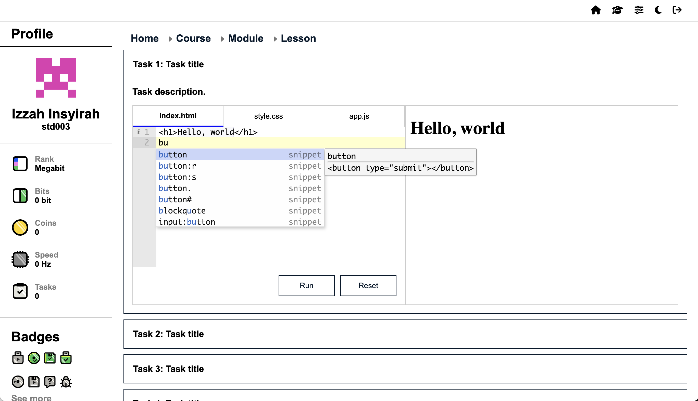

# CodeLearn - Online Coding Education Platform

**CodeLearn** is a web-based coding education platform designed to help students learn programming in a structured and interactive way. It offers a multi-level course structure, hands-on coding tasks, and an in-browser editor with a Python Blockly toggle for beginners.

---

## 🚀 Features

### 🧩 Structured Course Hierarchy
- Courses → Modules → Lessons → Tasks
- Each course contains:
  - **6 Modules**
  - Each module has **10 Lessons**
  - Each lesson includes **10 Tasks**
- Dynamically generated using scalable data structures (no hardcoded pages)

### 💻 Interactive Code Editor
- Built-in **Ace Editor** for real-time coding
- Toggle between **text-based Python coding** and **block-based Python (Blockly)**
- Syntax highlighting and error feedback

### 🐢 Python Turtle Integration
- Supports visual output using Python Turtle
- Great for kids and beginners to learn programming visually

### 👤 User Management
- Secure **login system**
- Redirects users to their personalized dashboard upon login

### 📚 Progress Tracking
- Automatically tracks user progress through courses and tasks
- Potential for future integration with leaderboards and badges

### 💳 Payment Integration *(In Progress)*
- Users will be able to purchase access to premium courses
- Payment gateway support planned (Stripe/FPX)

---

## 🛠️ Technologies Used

- **Frontend:** HTML, CSS, JavaScript
- **Backend:** PHP
- **Editor:** Ace Editor, Blockly
- **Storage:** (Planned) LocalStorage / MySQL
- **Visual Assets:** PNGs for UI and animations

---

## 📸 Screenshot

---

## 📌 Future Improvements

- Add user leaderboard and certificate generation
- Expand to support more languages (HTML/CSS, JavaScript)
- Admin dashboard for content creation and analytics
- Better mobile responsiveness and offline mode

---

## 🧑‍💻 Developed by
Idham Malik  

---

## 📄 License

This project is licensed under the MIT License.
